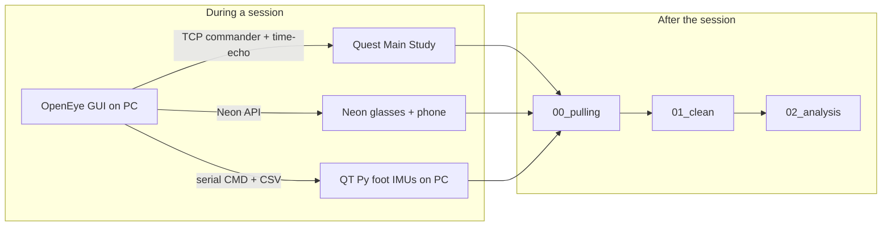

# gazeGait

VR Fitts study on **Meta Quest 3** (OpenEye Neon gaze) with **dual foot IMUs**, while walking on a treadmill or standing. The PC OpenEye GUI commands the Quest app, records Neon + foot IMU, and writes clock offsets so every stream can be aligned later.

This GitHub repo is **code and docs only**. Participant recordings live on the lab machine under `data/` and are gitignored.

Parent repository: [thommakoon/gaze-gait-process](https://github.com/thommakoon/gaze-gait-process) (private). Capture apps are separate public submodules (Quest / OpenEye / Neon Player / gait).



---

## Clone and setup

```powershell
git clone --recurse-submodules https://github.com/thommakoon/gaze-gait-process.git
cd gaze-gait-process
git submodule update --init --recursive
```

Python steps use [uv](https://docs.astral.sh/uv/). Each `scripts/0N_*/` folder has its own `pyproject.toml`:

```powershell
cd scripts\01_clean
uv sync
```

You also need:

- Unity **2022.2.9f1** to rebuild the Quest APK
- Android Studio for **URP2026** (phone IMU path; walk sessions now record IMU on the **PC**)
- Arduino IDE for QT Py firmware (`motorola/firmware/sketch_usb_dual_100_cmd`)
- `adb` for Quest wireless launch / pull

---

## Study protocol (locked)

Each **participant** does **12 recordings** (4 bouts × 3 interactions).

| Bout folder | Quest `subsub` | Posture | Layout | `ring_sets` |
|-------------|----------------|---------|--------|-------------|
| `PracticeRing` | 2 | standing | 11-target ring | 2 |
| `PracticeRectangle` | 3 | standing | two horizontal bars L/R | 2 |
| `Ring` | 0 | walking | 11-target ring | 3 |
| `Rectangle` | 1 | walking | two horizontal bars L/R | 3 |

Interactions (cursor + pinch confirm):

| Folder | Cursor | Confirm |
|--------|--------|---------|
| `HeadPinch` | head ray | pinch |
| `HandPinch` | hand ray | pinch |
| `EyePinch` | OpenEye Neon gaze | pinch |

Fitts IDs are the same six angular A×W pairs for ring and rectangle:

`W ∈ {3,4,5}°` × `A ∈ {30,20}°` → Shannon `ID = log2(A/W+1)` ≈ 3.46, 3.09, 2.81, 2.94, 2.58, 2.32.

| Parameter | Value |
|-----------|--------|
| Wall depth | 2 m |
| Ring | 11 targets, step 5 |
| Rectangle | horizontal L/R only, height 30° |
| Counted hits per ID | **10** (rectangle drops the opening target) |
| Pause between rectangle IDs | 0.5 s (not in MT) |
| Dwell-to-select (legacy EyeDwell) | 1.0 s |
| Per-target timeout | 5.0 s |
| Quest log rate | 100 Hz |

Practice is standing: **no foot IMU** in the clean pipeline. Walking Ring/Rectangle **need** LF/RF IMU.

OpenEye 5×5 calib (25 dots) is **inside Main Study**, on the same 2 m plane: H ±20°, V +15°…−35°. Shared models go to `data/participants/participantN/models/`. If a walking bout has no calib, reuse the matching Practice bout (same interaction).

---

## Repository structure

```text
gazeGait/
├── README.md                      ← this file
├── docs/                          session notes (points at OpenEye operator flow)
├── data/                          NOT in git — recordings + derived products
│
├── QuestApp-MainStudy/            Unity APK  com.PracticeMG.MRstress   (Quest 3 + Neon)
├── QuestApp-MainStudy-Pro/        Unity APK  com.PracticeMG.MRstressPro (Quest Pro + OVR eyes)
├── QuestApp-PracticeTask/         optional auto-practice APK
│
├── external/
│   ├── OpenEye/                   PC GUI: Neon, TCP commander, calib, sync, PC IMU
│   ├── OpenEye-QuestPro/          same GUI family for Quest Pro
│   ├── neon-player/               Pupil Neon Player (export / inspect)
│   └── imu_gait_analysis/         foot IC / stride (used by analysis step 3)
│
├── motorola/                      QT Py firmware + PC serial / Neon helpers
├── URP2026/                       Android app: phone-side Neon + IMU (legacy walk path)
│
└── scripts/
    ├── quest_adb/                 wireless ADB: launch/quit Main Study, OpenEye launchers
    ├── 00_pulling/                GUI: pick Quest vs Neon serials, pull into data/
    ├── 01_clean/                  clocks → 200 Hz grid → Xsens gait bundle
    ├── neon_export/               optional Neon Player CSV export (events plugin off)
    ├── 02_analysis/               Fitts / I-VT / gait onset / H(f)
    └── 03_viewer/                 optional local web UI for gait bundles
```

Unity `Library/`, APKs, `data/`, videos, and zip backups are not committed.

### Submodules

| Path | Remote |
|------|--------|
| `QuestApp-MainStudy` | [QuestApp-MainStudy](https://github.com/thommakoon/QuestApp-MainStudy) |
| `QuestApp-MainStudy-Pro` | [QuestApp-MainStudy-Pro](https://github.com/thommakoon/QuestApp-MainStudy-Pro) |
| `QuestApp-PracticeTask` | [QuestApp-PracticeTask](https://github.com/thommakoon/QuestApp-PracticeTask) |
| `external/OpenEye` | [OpenEye](https://github.com/thommakoon/OpenEye) |
| `external/OpenEye-QuestPro` | [OpenEye-QuestPro](https://github.com/thommakoon/OpenEye-QuestPro) |
| `external/neon-player` | [neon-player-custom-GAIT](https://github.com/thommakoon/neon-player-custom-GAIT) |
| `external/imu_gait_analysis` | [imu_gait_analysis](https://github.com/thommakoon/imu_gait_analysis) |

---

## Data structure (local `data/`, not uploaded)

One person = 12 bout folders plus shared calib:

```text
data/participants/participantN/
├── models/                              shared OpenEye ridge / biquadratic models
├── Ring|Rectangle|PracticeRing|PracticeRectangle/
│   └── HeadPinch|HandPinch|EyePinch/
│       ├── 00_raw/
│       │   ├── Quest/                   Main Study JSON (100 Hz) + quest_100hz.csv after export
│       │   ├── Motorola/                Neon Companion folder + LF/RF IMU CSV
│       │   ├── OpenEye/                 calib, gaze_log, evaluation, sync.json
│       │   └── coverage_check.json      written by check_coverage.py
│       ├── 01_corrected/                foot IMU timestamps Hampel-fixed
│       ├── 02_cleaned/                  bad IMU Δt dropped
│       ├── 03_grid_200hz/               shared 200 Hz grid (walking only)
│       ├── 04_grid_200hz_filled/        optional linear NaN fill
│       ├── 05_gait_xsens/               LF.csv / RF.csv + gaze_200hz / head_200hz
│       └── 06_gait_analysis/            IMU gait, I-VT, Fitts products
└── _mt_dwell_check/  _cursor_ivt/  _fitts_coupling/  _across_people/   pooled CSVs
```

### What each `00_raw` device folder is

**Quest** — one JSON per logged stream (`streamEye` / `streamHead` / `streamHand`). The cleaner keeps the stream that matches the interaction. Envelope fields include `sub_num`, `subsub_num`, `condition`, `ring_sets`, `data[]` at 100 Hz (cursor, hits, dwell, pinch).

**Motorola** — dated Neon Companion export (`info.json`, `gaze ps1.raw`, `imu ps1.raw`, scene video, …) plus PC (or URP) foot files `LF_imu_fused_*.csv` / `RF_imu_fused_*.csv`. Extra aborted takes should be parked in a `_` subfolder so coverage sees **one** Neon and **one** IMU.

**OpenEye** — GUI writes here **during** the session:

| File | Role |
|------|------|
| `sync.json` | `offset_quest_to_pc_ns`, `offset_phone_to_pc_ns` (required before Neon/IMU record) |
| `calibration/` | pair log + raw Neon for the 25-dot grid |
| `models/` or person-level `models/` | fitted gaze map |
| `gaze_tracking/gaze_log.jsonl` | live mapped gaze |
| `evaluation/` | random-saccade eval summaries |

### Walking grid (`03_grid_200hz`)

All streams resampled onto one 200 Hz UTC/PC axis. `grid_200hz_meta.csv` has valid fractions (`quest_valid_frac`, gaze, LF, RF). A low Quest fraction with gaze/LF ≈ 1.0 usually means Neon/IMU ran longer than the Fitts block (padding), not a missing overlap. Coverage **fails** a stream if its fraction is &lt; 0.5; Quest &lt; 0.5 **warns**.

Practice standing **stops after export**: no foot grid, so Neon I-VT while standing is **not** on the same 200 Hz product as walking.

---

## Clocks

Everything is shifted onto the **PC clock**.

```text
Quest unix ms  +  offset_quest_to_pc_ns   →  t_pc_ns
Neon  ns       +  offset_phone_to_pc_ns   →  t_pc_ns
Foot IMU       receive / SampleTimeFine mapped in 01_02 then onto the same axis
```

`sync.json` is written live by the OpenEye hub (Quest TCP time-echo + Neon time-echo). Walking **Start condition** / Neon record / IMU record should not run until that file has **both** offsets for the current bout.

If a bout is missing `sync.json`, you can copy from another bout of the same person only as a last resort (Quest↔PC offset is usually a few tens of milliseconds). Prefer re-sync.

---

## Code run order

### A. During collection (operator)

Canonical GUI steps: [external/OpenEye/quest/gui_unit/OPERATOR_FLOW.md](external/OpenEye/quest/gui_unit/OPERATOR_FLOW.md).

Current **walk** hardware: QT Py USB into the **PC** (`sketch_usb_dual_100_cmd` @ 230400). Phone runs **Neon Companion only**. URP2026 is the older all-on-phone path.

1. Edit `scripts/quest_adb/quest_adb.ps1` (`$Adb`, `$QuestIp`).  
   `quest_adb.cmd usb-wifi` → unplug → `quest_adb.cmd connect` → `quest_adb.cmd switch main`.
2. Launch OpenEye: `scripts/quest_adb/openeye_quest3_gui.cmd` (PC IMU) or `openeye_quest3_gui_phone.cmd` (URP IMU).
3. In the GUI pick **participant + bout + interaction** first. Calib / eval / record refuse to start until all three are set. Outputs go to that bout’s `00_raw/OpenEye` and `00_raw/Motorola`.
4. Quest: open Main Study (IDLE). Optional Meta-pinch to re-center the wall.
5. **Calib** (once per person, inside Main Study): 25 dots, ≥1 s each.
6. Optional visualize / evaluation.
7. **Walk operator** (G/H/I/J) or standing Fitts:
   - stages 1–2: `CMD:CALIBRATE` then `CMD:START` on the QT Py  
   - stage 3: PC hub sync → `sync.json`  
   - stage 4: Neon recording + PC IMU CSV (blocked until both offsets exist)  
   - stage 5: **Start condition** (Quest Fitts)  
   - stage 6: stop Neon + IMU + serial after `mainStudyDone`
8. Standing Practice: same commander, no foot IMU. Still need `sync.json` for Quest↔Neon.

HUD welcome/thank-you is blanked; green treadmill path is off at study start.

### B. Pull devices → `data/`

```powershell
cd scripts\00_pulling
uv sync
uv run python pull_gui.py
```

Quest folders on headset are `<sub>-<subsub>` under  
`/Android/data/com.PracticeMG.MRstress/files/`  
(`0=Ring, 1=Rectangle, 2=PracticeRing, 3=PracticeRectangle`). One Quest folder often has **three** Neons (Head/Hand/Eye). Pull each interaction into its own bout:

```text
data/participants/participantN/<Bout>/<Interaction>/00_raw/{Quest,Motorola}/
```

Copy PC IMU sessions from `Documents/PC_imu_sessions/<timestamp>/` into that Motorola folder. Park aborted extra takes.

### C. Clean (required before analysis)

```powershell
cd scripts\01_clean
uv sync
uv run python run_pipeline.py --participant N --all --keep-going
```

What `run_pipeline.py` actually runs:

| Order | Script | Walking Ring/Rectangle | Practice standing |
|-------|--------|------------------------|-------------------|
| pre | `check_coverage.py --stage pre` | extra takes, `ring_sets`, PC-clock overlap ≥ 8 s | same, feet optional |
| 01a | `01_01_export/neon_raw_to_csv.py` | Neon raw → `gaze.csv` / `imu.csv` on PC clock | yes |
| 01b | `01_01_export/convert_quest_to_pc_ns.py` | Quest JSON → `quest_100hz.csv` | yes |
| 02 | `01_02_correct_utc/correct_imu_t_utc.py` | Hampel-fix foot receive times | skip |
| 03 | `01_03_drop_dt/drop_imu_bad_dt.py` | drop bad IMU spacing | skip |
| 04 | `01_04_grid_200hz/grid_utc_200hz.py` | 200 Hz shared grid | skip |
| 05 | `01_05_gait_xsens/format_foot_xsens_csv.py` | Xsens `LF.csv`/`RF.csv` + Madgwick head | skip |
| post | `check_coverage.py --stage post` | grid valid fractions | Quest vs Neon overlap |

One bout:

```powershell
uv run python run_pipeline.py --participant N --bout Ring --interaction EyePinch
```

`--fill` adds linear NaN fill (`04_grid_200hz_filled/`). `--skip-coverage` omits the checks.

If walking OpenEye calib is missing after all 12 recordings:

```powershell
uv run python link_practice_openeye_calib.py --participant N --dry-run
uv run python link_practice_openeye_calib.py --participant N
```

### D. Analysis

```powershell
cd scripts\02_analysis
uv sync
git submodule update --init external/imu_gait_analysis   # from repo root if needed
uv run python run_analyses.py --participant N --keep-going
```

`run_analyses.py` (default 1–6; pass `--only 7` after several people):

| # | What | Script | Needs |
|---|------|--------|--------|
| 1 | Median MT, dwell, hit rate | `02_05_cursor_stability/check_mt_dwell.py` | Quest JSON, all 12 |
| 2 | I-VT fixation/saccade counts | `02_03_saccade/cursor_ivt_counts.py` | walking: Neon `gaze_200hz`; head/hand: Quest |
| 3 | Foot ICs + Fitts event vs LF gait % | `02_01_imu_gait/…` then `02_02_fitts_gait/fitts_gait_onset.py` | `05_gait_xsens/LF.csv` |
| 4 | Wall cursor trajectories | `02_05_cursor_stability/wall_trajectory.py` | Quest |
| 5 | Effective Fitts `W_e` / `ID_e` / `TP_e` | `02_06_fitts_coupling/effective_fitts.py` | Quest; last 125 ms before pinch dropped |
| 6 | Foot → pointer `H(f)` | `02_06_fitts_coupling/transfer_function.py` | 200 Hz foot grid (walking only) |
| 7 | Collapse to **person cells**, mean±SE | `02_07_across_people/across_people.py` | outputs of 1–6 |

Gait-phase plots use **left-foot stride** (`0%` = left initial contact). Do not mix LF and RF origins across people. Practice bouts are skipped for gait unless you pass `--bout PracticeRing`.

The inferential unit is the **participant**, not the trial. Do not pool every click from everyone into one mean.

### E. Optional viewer

```powershell
cd scripts\03_viewer
uv sync
uv run python serve_gait_xsens.py --open
```

---

## What the code does (by area)

### Quest Main Study (`QuestApp-MainStudy`)

Unity Fitts app. Boots **IDLE** until OpenEye sends `mainStudyStart` (`sub`, `subsub`, condition, `ring_sets`, `layout`). Logs 100 Hz JSON, then `mainStudyDone` and returns to IDLE.

Important scripts: `GameManager.cs` (loop + logging), `StudyDesign.cs` (ring vs two-rect, counted hits), `FittsRingPresets.cs` (A×W table), `OpenEyeGazeReceiver.cs` (TCP), `EyeGazeProvider` / `HeadGazeProvider` / `HandProvider` (cursors).

Quest Pro fork uses Meta OVR eyes (`com.PracticeMG.MRstressPro`) and `external/OpenEye-QuestPro`.

### OpenEye GUI (`external/OpenEye`)

PC operator app. Connects Neon, TCP to Quest, in-headset calib/eval, live mapped gaze, hub time-echo, walk stages, PC IMU monitor. Writes `sync.json` and OpenEye logs into the **current bout** folder. Restart the GUI after pulling this repo so Python changes load.

### Foot IMU (`motorola/` + optional `URP2026/`)

- Firmware `sketch_usb_dual_100_cmd`: dual ICM-20948, `CMD:CALIBRATE` / `START` / `STOP`, 20-field lines @ 230400.
- PC records `LF_imu_fused_*.csv` / `RF_imu_fused_*.csv` (`SampleTimeFine`, `t_utc_ns`, acc/gyr/mag).
- `URP2026` does the same on the phone (USB OTG + Neon localhost API), including a foreground recording service. Walk protocol currently prefers PC USB.

### `scripts/00_pulling`

PySide6 picker for Quest vs Neon ADB serials. Lists Quest JSON by `sub-subsub` and Neon Export folders; **Match selected Quest** keeps Neon recordings whose `start_time`+`duration` overlap the Quest timeline.

### `scripts/01_clean`

See [scripts/01_clean/README.md](scripts/01_clean/README.md). Shared paths: `_paths.py`. Entry: `run_pipeline.py`.

Coverage **pre**: extra Quest JSON or IMU takes, expected `ring_sets`, ≥8 s overlap on the PC clock.  
Coverage **post**: walking `grid_200hz_meta` fractions; standing Quest vs Neon overlap.

### `scripts/02_analysis`

See [scripts/02_analysis/README.md](scripts/02_analysis/README.md). Entry: `run_analyses.py`.

- **I-VT defaults:** eye 500 px/s (Neon), head 25 deg/s, hand 40 deg/s, min duration 20 ms. Standing vs walking eye I-VT is not comparable if standing never got a 200 Hz Neon grid.
- **Effective Fitts:** `W_e = 4.133 σ` on the approach axis (ISO 9241-9). Ballistic = target appear → peak wall speed; homing = peak → first hit.
- **Skip a bout** when Neon is missing (no eye I-VT / mapped dwell) or when there is no shared ridge model (no mapped OpenEye dwell).

### `scripts/quest_adb`

Launch/quit APKs over wireless ADB. Does **not** replace OpenEye TCP. `switch main` must print `PKG_MAIN_STUDY=com.PracticeMG.MRstress`.

---

## Typical commands (copy-paste)

```powershell
# Pull
cd scripts\00_pulling
uv run python pull_gui.py

# Clean all 12 bouts
cd ..\01_clean
uv run python run_pipeline.py --participant 21 --all --keep-going

# Analyses 1–6 for one person; 7 after several people
cd ..\02_analysis
uv run python run_analyses.py --participant 21 --keep-going
uv run python run_analyses.py --participants 21 22 23 --only 7
```

More flags and QC plots: [scripts/01_clean/README.md](scripts/01_clean/README.md), [scripts/02_analysis/README.md](scripts/02_analysis/README.md), [scripts/quest_adb/README.md](scripts/quest_adb/README.md).
